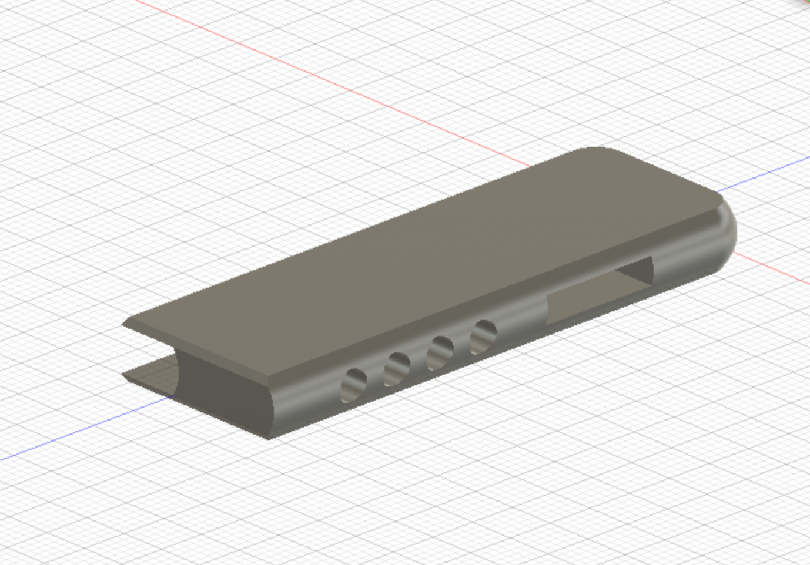
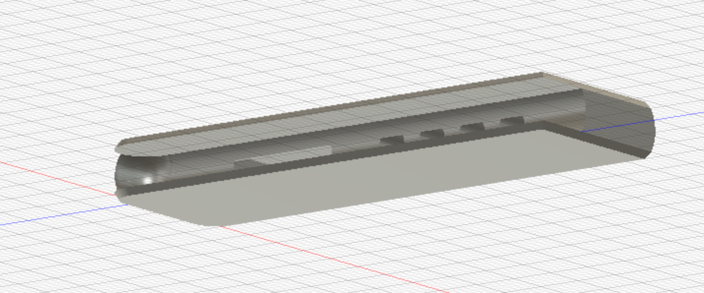

# typeO

e-paper typing software and hardware

## Background

For now, this repo is for collecting relevant information for the prototyping of the typeO using a remarkable and a keyboard.

## Pogo pin connector

The pogo pin connector is in prototype stage. The goal of this device is to provide keyboard access to the reMarkable 2 through the Pogo pins, which have OTG support (unlike the USB C port).

### Software

See [pogo-pin-software.md](/pogo-pin-software.md)

### Hardware

#### Prototype:

https://www.youtube.com/watch?v=7q5tBEi4npA

#### Parts list

- Pogo pin header: https://www.digikey.com/en/products/detail/821-22-005-10-001101/ED8198-05-ND/1146577?itemSeq=360991255
- USB C breakout: https://www.digikey.com/en/products/detail/4090/1528-2873-ND/9951930?itemSeq=360991872
- 10K ohm resistor: https://www.digikey.lu/en/products/detail/stackpole-electronics-inc/CF14JT10K0/1741265
- 1/8in x 1/2in magnets: https://www.kjmagnetics.com/proddetail.asp?prod=D28-N52&cat=168

#### Circuit

[Prototype circuit diagram](/prototype_circuit.fzz)

([Reference USB-C pinout](https://electronics.stackexchange.com/questions/291413/usb-c-to-usb-a-pinout/291427))

#### 3D printed part

The 3D printed part holds the magnets and pogo pin headers together and friction fits onto the remarkable. The magnets and flange help it align, and the pins should contact.

## Future

[Feature wishlist](/feature-wishlist.md)

## Other resources

[See also link collection](/sick-links.md)
